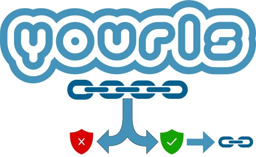
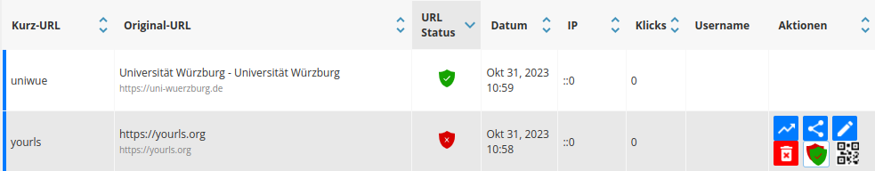
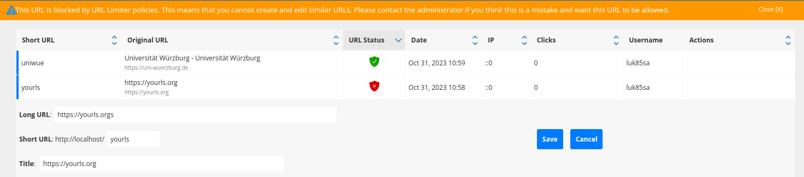
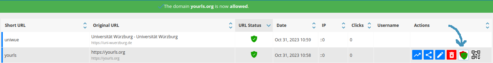
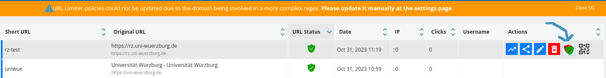
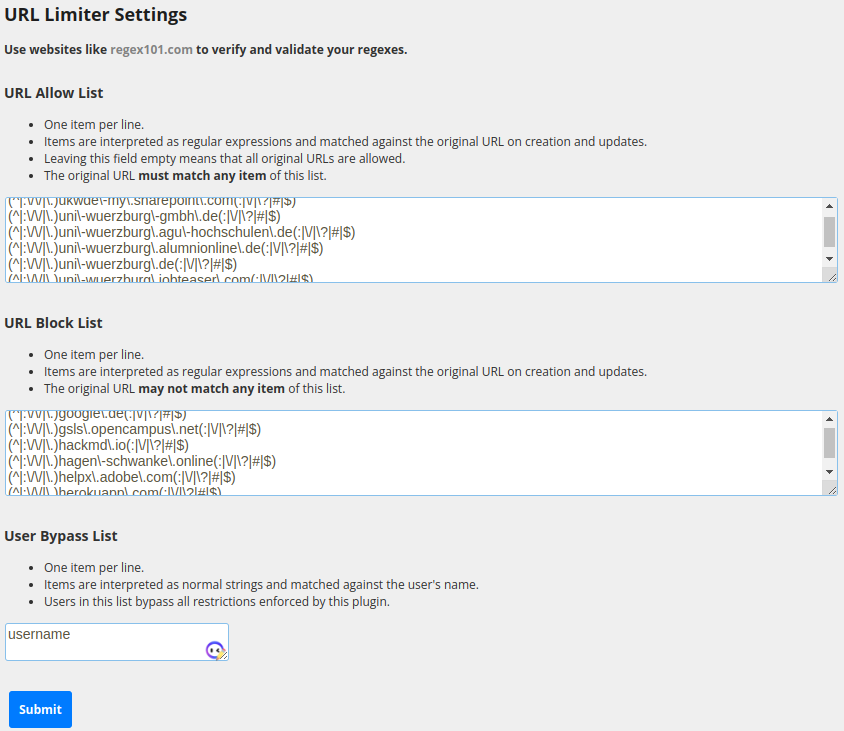

<p align="center">
  <a href="https://github.com/uniwue-rz/yourls-original-url-regex-limiter">
    
  </a>
</p>

<p align="center">
  <a href="https://prototype.php.net/versions/7.4.0/">
    
  </a>
  <a href="https://github.com/YOURLS/YOURLS">
      
  </a>
  <a href="https://github.com/YOURLS/awesome">
    </a>
</p>

<p align="center">
  <a href="#features">Features</a> •
  <a href="#limitations">Limitations</a> •
  <a href="#installation">Installation</a> •
  <a href="#Contributing">Contributing</a> •
  <a href="#License">License</a>
</p>

# Original URL Regex Limiter

This plugin extends the functionality of [YOURLS](https://github.com/YOURLS/YOURLS) by allowing entitled persons to restrict the original URLs with regular expressions. It simultaneously supports both allow- and block-listing as well as granting eligible users the capability to circumvent these limitations.

## Features
- allowing/blocking original URLs by regexes:
  - **must match any regex in the allow list** (*default: all allowed*)
  - **may not match any regex in the block list** (*default: none blocked*)
  - **backwards-compatible to existing URLs** as restrictions are only enforced upon creation of new shortlinks or editing of existing ones
- original URL status (allowed or blocked):
  - is display in admin area's main table
  - can be filtered with an additional search field under the table
- grant users permissions to:
  - bypass these restrictions by being put into a list (*default: none allowed*)
  - quick-toggle allowing/blocking of a URL by its corresponding domain regex (*default: administrators*)
  - edit raw regexes and user bypasses in the plugin's admin page (*default: administrators*)
- internationalization support (currently only translated to `de-DE`)
- (optional) role-based access control of above permissions with [AuthMgrPlus](https://github.com/joshp23/YOURLS-AuthMgrPlus) integration (see [configuration](#AuthMgrPlus))


## Limitations
- regex expressionality
  - enforcer (our decision-maker) uses the PCRE regex support of PHP to validate and match regexes
  - main table search filter manipulates the existing SQL query by adding `REGEXP` statements to the `WHERE` clause
  - this could lead to problems when using regex features (e.g. lookarounds) that are supported by PCRE, but not your database implementation, which would result in SQL errors when using the main table's url limiter status search filter
  - **TIP**: use database implementations that also use PCRE (like [MariaDB](https://mariadb.com/kb/en/pcre/))
- regex list expressionality
  - the current implementation only supports: "must be matched by a regex in the allow list and may not be matched by a regex in the block list"
  - this could be improved in the future by implementing a DSL


## Installation

### Download
You can either install this plugin via composer with

```bash
composer require bla
```

or you can manually download the [latest release](https://github.com/uniwue-rz/yourls-original-url-regex-limiter/releases) and place it into yourls' `user/plugins` directory.

### Activation
After that, head to your yourls' plugin list and activate it.

### AuthMgrPlus
(Skip this section if you do not use this plugin.)

- add `uniwue-url-limiter-is-allowed` capability to `$amp_anon_capabilities` list
  - allows everyone to query this plugin's ajax endpoint that returns the URL decision for each entry in the main table
- add `uniwue-url-limiter-bypass-enforcement` capability to roles that are allowed to bypass the restrictions of this plugin (*default: none*)
- add `uniwue-url-limiter-toggle-by-domain` capability to roles that are allowed to quick-toggle domains by their regexes with an added actions button in the main table (*default: administrators*)
- add `uniwue-url-limiter-edit-raw` capability to roles that are allowed to edit the raw regexes and the explicit user bypass list at the plugin's settings page


## Usage

Main table view with added URL status column and toggle-by-domain actions button:


Error upon creation/editing of blocked URLs:


Successfully toggling a URL by domain regex:


Failing to toggle a URL by domain regex that is involved in a more complex regex:


Settings page of the plugin:


## Contributing

Pull requests are welcome. For major changes, please open an issue first to discuss what you would like to change.


## License
[MIT](./LICENSE)
